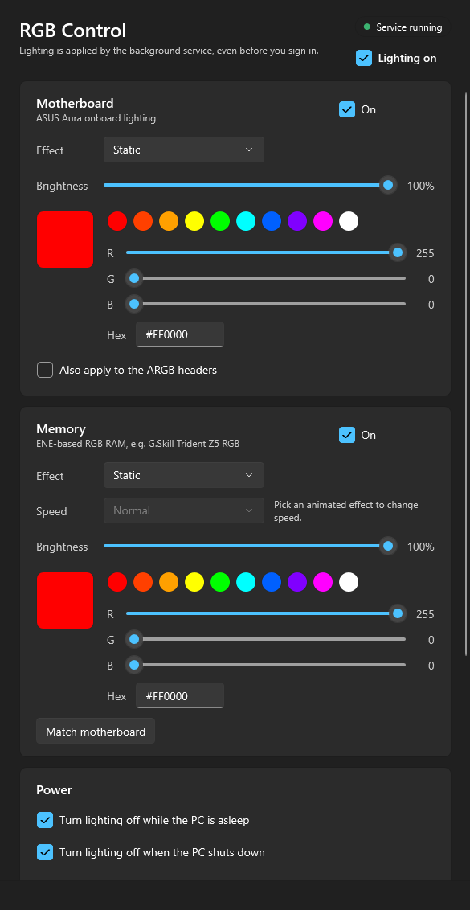

# RGB Control

A lightweight, open-source replacement for vendor RGB software on Windows. It controls **ASUS Aura**
motherboard lighting and **ENE-based RGB RAM** (such as G.Skill Trident Z5 RGB) without Armoury Crate,
iCUE or G.Skill's lighting app.

Version 1.1.0 adds experimental separate ARGB-header settings (including
NZXT Kraken Core lighting), Sapphire NITRO+ / PowerColor Red Devil RX 9070 XT direct GPU control,
and Gigabyte B650 AORUS Elite AX control. See [hardware support and validation status](docs/hardware-support.md).
These additions have not yet completed hardware power-cycle testing.

- Lighting is applied by a Windows service **at boot, before you sign in**.
- Lighting turns **off at shutdown and sleep**, and back on when the PC wakes. The board no longer
  lights up your room at night.
- A desktop app with a **tray icon** lets you pick effects, colors, brightness and speed, or switch
  all lighting off in one click.



## Download

1. Go to **[Releases](https://github.com/Romoslayer/rgb-control/releases/latest)** and download
   `RgbControl-Setup-x.y.z.exe`.
2. Run it. Leave **Install the PawnIO driver** ticked if you want RAM lighting.
3. Open **RGB Control** from the Start Menu.

No .NET install is needed. The installer isn't code-signed, so Windows SmartScreen may warn you;
choose **More info > Run anyway**.

To uninstall, use **Settings > Apps > Installed apps > RGB Control**.

## Supported hardware

| Device | How it's controlled | Notes |
|---|---|---|
| ASUS Aura USB motherboard controller (USB `0B05:18F3`, `1939`, `19AF`, `1AA6`, `1BED`) | USB HID, no driver needed | Tested on ROG Strix B850-E Gaming WiFi. Onboard LEDs and ARGB headers. |
| ENE SMBus RGB RAM on AMD chipsets | SMBus via [PawnIO](https://pawnio.eu/) | Tested on G.Skill Trident Z5 RGB (DDR5). Needs PawnIO installed. |

If your BIOS lighting setting is **off** (or "Stealth mode"), the motherboard ignores software.
Set it to on and let RGB Control handle turning it off when the PC is off.

Speed is only available for RAM; the Aura USB protocol has no speed setting. Brightness works by
dimming the color, so it doesn't affect rainbow and spectrum effects.

## RAM safety

RAM lighting chips share the SMBus with each DIMM's SPD and power-management chips. RGB Control:

- only ever talks to addresses `0x70`-`0x76` (DDR5 PMICs at `0x48`-`0x4F` and SPD at `0x50`-`0x57` are never touched),
- only writes to a controller after it passes the ENE signature check **and** reports a firmware
  version with a known register layout,
- never saves to the RAM's flash; settings are re-applied at every boot and wake,
- uses the system-wide SMBus lock shared with OpenRGB, HWiNFO and similar tools.

## How it works

| Project | Purpose |
|---|---|
| `src/RgbControl.Core` | Aura USB protocol (HidSharp), ENE DRAM over SMBus (PawnIO), config model, lighting actions |
| `src/RgbControl.Service` | Windows service: applies lighting at boot, on config changes, and around shutdown/sleep/wake |
| `src/RgbControl.App` | WPF desktop app and tray icon; saves the config, and the service applies it |
| `src/RgbControl.Cli` | `rgbctl` command-line tool for probing and testing |
| `installer/` | Inno Setup script for the release installer |
| `modules/` | Signed PawnIO `SmbusPIIX4` module (PawnIO.Modules 0.2.11, LGPL-2.1) |

Settings live in `C:\ProgramData\RgbControl\config.json`; the service re-applies them whenever the file
changes. Service logs are in **Event Viewer > Windows Logs > Application**, source `RgbControl`.

Changes in the app save automatically and are restored by the service at Windows startup and wake.
No separate save is needed. Enable shutdown/sleep off to turn managed lighting off at those times.
The ASUS-only "Save startup color" option writes motherboard settings for the period before Windows
starts; it is separate from automatic saving and is not available for the new GPU or Gigabyte controls.

## Building from source

Requires the .NET 10 SDK.

```powershell
dotnet build RgbControl.slnx
dotnet run --project tests/RgbControl.Checks/RgbControl.Checks.csproj
.\scripts\install-service.ps1        # admin PowerShell: builds and installs locally
```

Useful CLI commands (`src\RgbControl.Cli`):

```powershell
rgbctl probe                    # read-only motherboard controller info
rgbctl set static "#FF0000"     # temporary motherboard effect
rgbctl ram-probe                # read-only RAM scan (admin)
rgbctl gpu-probe                # read-only supported AMD GPU state
rgbctl gigabyte-probe           # read-only Gigabyte controller identity
rgbctl ram-set breathing "#0060FF"   # temporary RAM effect (admin)
```

### Releasing

Push a tag like `v1.2.0`. The [release workflow](.github/workflows/release.yml) publishes self-contained
builds, compiles the installer and attaches it to a GitHub release.

## Credits

- The Aura USB and ENE SMBus protocols were learned from [OpenRGB](https://gitlab.com/CalcProgrammer1/OpenRGB)
  (`AsusAuraUSBController`, `ENESMBusController`).
- SMBus access uses [PawnIO](https://pawnio.eu/) and its signed modules.
- USB HID access uses [HidSharp](https://www.zer7.com/software/hidsharp) (Apache-2.0).

## License

[GPL-3.0](LICENSE).
